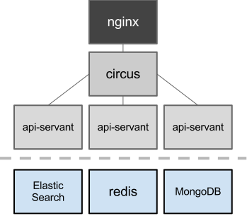

========================================
CashKamera High Level Technical Overview
========================================
:Info: See the `docs repository <https://github.com/waawal/cashkam-meta>`_ for the latest source.
:Author: Daniel Waardal

This is the internal documentation of the inner workings of the CashKam platform.

API Endpoints
=============

Router
------

TBD

Load Balancing
--------------

TBD

Workers
=======

Sessions
========

TBD

Streaming
---------

TBD

Data Storage
============

TBD

Geographical Queries
--------------------

TBD

Media
-----

TBD

Users
-----

TBD

Ads
---

TBD