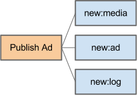

=======
Backend
=======

API Endpoints
-------------

.. figure::  _static/backend_drawing.png

The Endpoint architecture runs exclusively on Ubuntu 12.04. It consists of a multiprocess pre-forked WSGI-app on coro-steroids (``gevent``) communicating over a unified REST-interface with all the frontends.

Router
~~~~~~

``NGINX`` routes based on subdomains to the correct port set up in ``CIRCUS``.

Load Balancing
~~~~~~~~~~~~~~

``NGINX`` (+ DNS round robin and ``CARP`` for HA)

Workers
-------

Model of the Publish Ad workerflow:

``Celery``

.. note::
  During Aplha: ``RQ``

Media Workers
~~~~~~~~~~~~~

``OpenCV`` for thumbnailification and POI discovery.

.. note::
  During Aplha: http://wiki.nginx.org/HttpImageFilterModule

Geospatial Workers
~~~~~~~~~~~~~~~~~~

There are two categories of GEO-queus in CashKam;

1. ``new:ad`` - > when a new ad has been created.
2. ``update:pos`` - > when a device movement has been detected.

The ``new:ad`` queue looks for matches of the source against dynamic adlists. The ``update:pos`` looks through the users dynamic adlists after items matching the list-settings.

``Redis`` and ``MongoDB`` + Map/Reduce 

Maintenance Workers
~~~~~~~~~~~~~~~~~~~

``MongoDB`` + Map/Reduce

Sessions
--------

Sessions are stored in ``Redis`` hashes. There is a difference between App- and Web-session due to our current dual approach for pushing of data.

Web-sessions
^^^^^^^^^^^

Web sessions identifies theirselves by sending their auth-info in a cookie.

App-sessions
^^^^^^^^^^^^

App-sessions as opposed to the web-sessions sends their auth credentials in the HTTP-header.

Streaming
~~~~~~~~~

Streaming of data to sessions is achieved by the implementation of two technologies. On the app-side we use secure ``websockets`` and in the webbrowser we use ``ServerEvents`` since we don't need duplexed communication.

Data Storage
------------

Static files served over HTTP with ``NGINX``.

Geographical Queries
~~~~~~~~~~~~~~~~~~~~

``Elastic Search``

Media
~~~~~

``NGINX``

Users
~~~~~

``MongoDB``

Ads
~~~

``MongoDB``